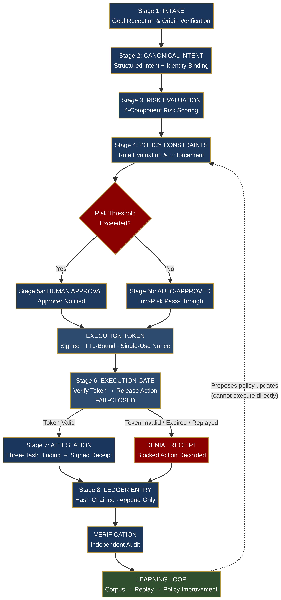

# Architecture — RIO Execution Governance Infrastructure

**Version:** 2.0
**Status:** Reference implementation (143 tests, 0 failures)

RIO is not a model. It is a *governed execution protocol* that sits between an agent and the real world. It does not advise. It gates.

> **Design principle: fail-closed.**
> If any condition cannot be positively verified, the execution gate remains locked. This is the inverse of most AI systems ("proceed unless blocked").

### 1. Pipeline — The 8-Stage Execution Path

Every action passes through an 8-stage pipeline before execution is permitted. The pipeline is enforced by the **Execution/Governance Loop**:

1. **Intake** — Raw goal or agent request
2. **Discovery & Refinement** — Vague requests are translated into a *structured intent* (action, target, parameters, requester identity). AI refinement is advisory; a human/system confirms the final intent.
3. **Classification** — Action type identified, risk category assigned
4. **Policy & Risk Evaluation** — Policy engine checks active rules; 4-component risk score calculated
5. **Authorization** — If risk exceeds threshold, human approver is notified. Upon approval, an *Execution Token* is generated (signed, TTL-bound, single-use nonce)
6. **Execution Gate** — Verifies token signature, timestamp, nonce, and kill switch *before* releasing the action
7. **Post-Execution Verification** — Computes three SHA-256 hashes that bind intent to outcome:
   - `intent_hash` — what was authorized
   - `action_hash` — what was executed
   - `verification_hash` — what was observed
8. **Receipt Generation** — Signed v2 receipt created
9. **Ledger Entry** — Receipt recorded in signed hash-chained ledger

> Denials are first-class: blocked or denied actions generate *denial receipts* and are recorded in the ledger. The audit trail covers every decision, not just successes.

**Three-Loop Architecture**
- **Intake Loop:** Goal → structured intent (Universal Grammar Layer)
- **Governance Loop:** Risk → policy → approval → token → gate → verify → receipt → ledger
- **Learning Loop:** Analyzes the audit trail, proposes policy updates via replay/simulation. *Cannot bypass governance or execute actions directly*



### 2. Receipts — The Three-Hash Binding

A v2 receipt is a cryptographically signed record of a single decision (approval or denial).

It contains:
- `intent_hash`, `action_hash`, `verification_hash` (SHA-256)
- Risk score and policy decision
- Three ISO 8601 timestamps (requested, authorized, executed/denied)
- Requester and approver identity
- Policy version and packet references

**Guarantee:** The three hashes cryptographically bind *what was intended, what was executed, and what actually happened*. A mismatch proves drift, tampering, or execution error.

Receipts are signed with Ed25519/ECDSA; forgery is detectable without access to the signing key.

### 3. Ledger — Tamper-Evident History

The v2 ledger is a *signed hash chain*. Each entry `En` contains:

```
Hn = SHA256(En.data + H(n-1))
```

**Guarantee:** Any modification to any entry invalidates all subsequent hashes. Each entry also carries its own signature for independent verification.

The ledger is append-only. Current implementation is single-node (distributed ledger is future work).

### 4. Verification — Independent Audit

RIO provides two standalone tools (no trust in the runtime required):
- **Receipt Verifier:** Validates signature, recomputes hashes, checks TTL/nonce
- **Ledger Verifier:** Recomputes the hash chain and verifies per-entry signatures

**How to verify (no access to RIO needed):**
1. Recompute `Hn = SHA256(En.data + H(n-1))`; mismatch = tampering
2. Verify Ed25519 signature against public key
3. Submit a used nonce → system rejects (replay protection)
4. Submit expired token → system rejects (TTL default 300s)
5. Attempt execution without token → gate remains locked

Test harness: 57 automated tests across 6 suites (Core Pipeline, Cryptographic Verification, v2 Receipt System, Denial & Edge Cases, Audit & Traceability, Governance Model).

### 5. Threat Model

RIO mitigates execution-layer threats in autonomous AI environments:

**Enforced by mechanism:**
- **Unauthorized execution** → Fail-closed gate; no token = no execution
- **Replay attacks** → Nonce registry (single-use tokens)
- **Stale authorization** → TTL expiry (default 300s)
- **Audit tampering** → Hash-chained ledger + per-entry signatures
- **Forgery** → Ed25519/ECDSA signatures on receipts
- **Silent denials** → Denial receipts (blocked actions are auditable)

**Out of scope (by design)**:
Data governance (training data quality/bias), model transparency/explainability (why the model recommended X), accuracy/robustness, content safety/guardrails, full lifecycle logging beyond execution, GDPR retention/minimization, HSM key management.

> RIO governs *what AI systems do*, not what they are trained on or what they say.

For the full threat analysis, see [Threat_Model.md](Threat_Model.md).

### 6. Trust Model

**Who do you have to trust?**
- The **signing key holder** (approver identity) for the authenticity of approvals. Keys are currently software-managed (HSM integration is future work).
- The **policy author** for the correctness of rules. Policies are versioned and recorded on receipts.

**Who do you *not* have to trust?**
- The runtime operator: receipts and ledger are independently verifiable.
- The agent: it cannot execute without a valid token.
- The audit system: hash chain + signatures detect tampering.

For the full trust model analysis, see [Trust_Model.md](Trust_Model.md).

### 7. Regulatory Alignment

**Regulatory mapping (evidence, not marketing):**
- **EU AI Act:** Art. 12 (record-keeping) via receipts/ledger; Art. 14 (human oversight) via fail-closed gate; Art. 9 (risk management) via risk engine.
- **NIST AI RMF:** GOVERN/MAP/MEASURE/MANAGE implemented via policy engine, intake loop, risk scoring, and approval gate.
- **ISO 42001:** A.6.2.8 (event logging) via automatic signed receipts.

RIO provides the infrastructure for a specific, demonstrable requirement: *a verifiable, cryptographic record that a specific action was authorized by a specific human, executed under a specific policy, verified against its stated intent, and recorded in a tamper-evident ledger that any independent party can audit*.

For the full technical assessment, see [EGI_Technical_Assessment.pdf](EGI_Technical_Assessment.pdf).

---

**Next:** See `/spec` for protocol invariants, `/schemas` for receipt/ledger JSON, and `/tests` for conformance.
