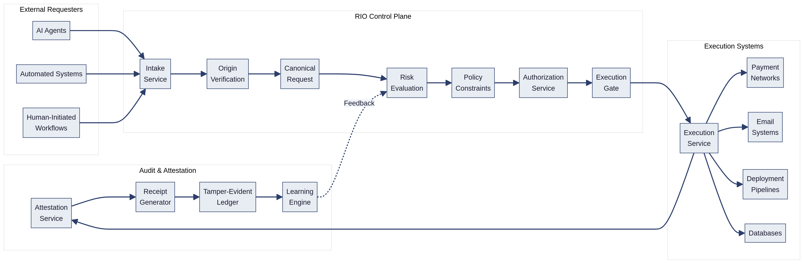
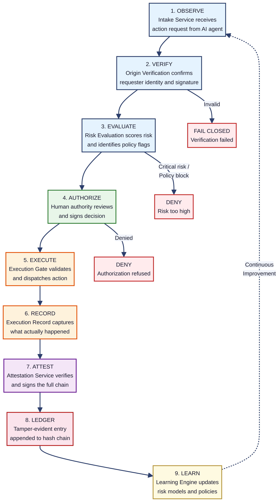
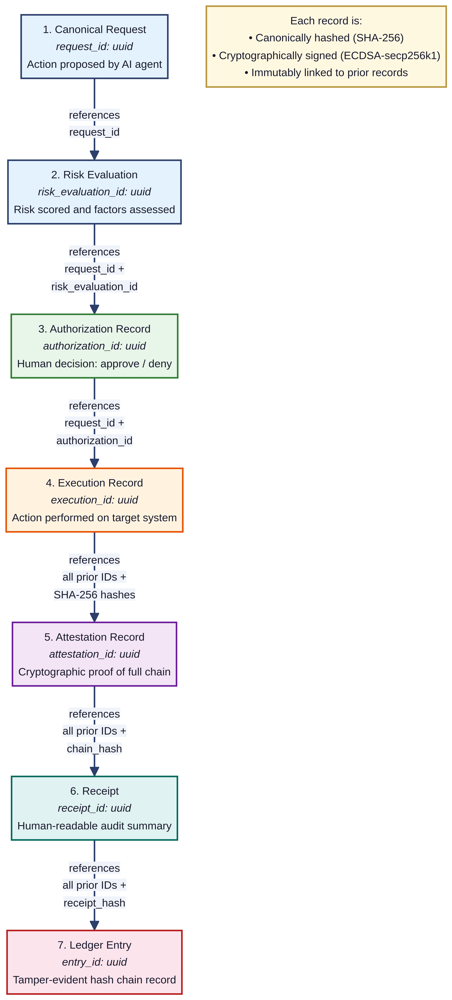
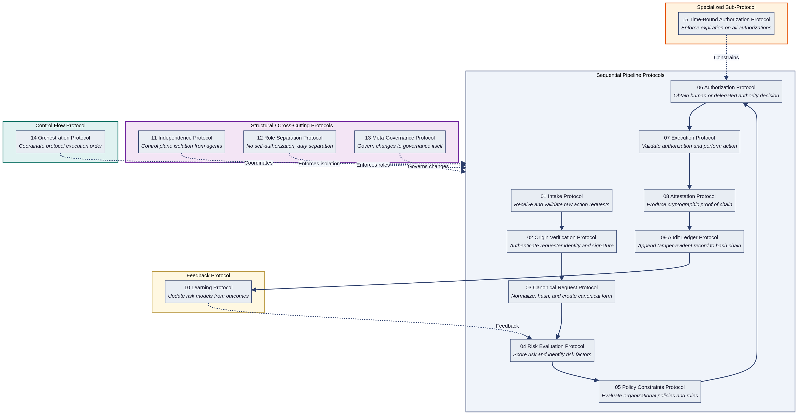
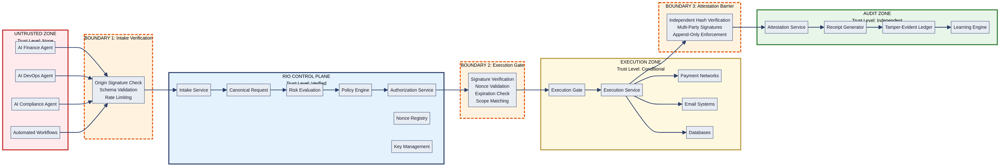

# RIO Protocol: A Fail-Closed Execution Governance System for AI and Automated Systems

**Version 1.0.0**
**March 2026**

---

## Abstract

The RIO Protocol is a fail-closed execution governance system that requires authorization before execution and produces cryptographic receipts and tamper-evident audit logs for every action taken by an AI agent or automated system. This white paper describes the protocol's architecture, its 15 constituent specifications, the data structures that form the decision traceability chain, the security model, the threat model, and the verification test suite. The protocol implements a pattern — the Governed Action Control Loop — that has been independently adopted across finance, aviation, medicine, cybersecurity, and other high-risk industries wherever the cost of an uncontrolled action exceeds the cost of governing it. RIO formalizes this pattern into a machine-readable, cryptographically verifiable standard designed for the specific challenges of AI-initiated actions: speed asymmetry, opacity of reasoning, and scale of consequence.

---

## 1. Introduction

AI agents are increasingly capable of proposing and executing consequential actions — initiating wire transfers, sending external communications, deleting production data, deploying code, and granting system access. These actions carry real-world consequences that are difficult or impossible to reverse once executed.

The fundamental problem is not that AI systems act, but that they act without a governance layer that enforces authorization, records decisions, and produces verifiable audit trails. Current approaches fall into two categories: blocking AI from acting (which eliminates the value of automation) or allowing AI to act without oversight (which creates unacceptable risk in regulated industries). Neither is sufficient.

The RIO Protocol addresses this gap by interposing a control plane between any requester and any execution target. The control plane enforces a deterministic pipeline: every action request is received, verified, normalized, risk-evaluated, policy-checked, and authorized before execution is permitted. After execution, the system produces cryptographic attestation, a human-readable receipt, and a tamper-evident ledger entry. If any step in the pipeline fails, execution is denied. There is no fail-open mode.

This white paper documents the protocol as implemented in the RIO Protocol repository. It does not introduce new architecture, protocols, or data structures beyond what exists in the repository.

---

## 2. System Category: AI Control Plane and Audit Plane

The RIO Protocol operates as two complementary planes:

The **Control Plane** governs the flow of action requests from intake through execution. It enforces origin verification, risk evaluation, policy constraints, and authorization. The execution gate — the final checkpoint before an action is released to an external system — validates that a cryptographically signed, unexpired, single-use authorization exists for the specific action being performed.

The **Audit Plane** operates independently of the control plane and is responsible for producing cryptographic attestation, receipts, and tamper-evident ledger entries. The audit plane does not participate in the authorization decision; it records and verifies the outcome. This separation ensures that the audit trail cannot be influenced by the entities whose actions it records.

Together, the two planes provide a complete governance system: the control plane ensures that no action executes without valid authorization, and the audit plane ensures that every action — whether approved, denied, or failed — is permanently and verifiably recorded.

---

## 3. The Problem: AI Systems Can Execute Actions Without Verifiable Authorization

Three properties of AI-initiated actions distinguish them from traditional automated workflows and make governance both more difficult and more important:

**Speed asymmetry.** AI agents can propose and execute actions in milliseconds. Human review operates on the order of seconds to minutes. Without a mechanism to pause execution pending authorization, the action completes before any oversight is possible.

**Opacity of reasoning.** AI agents may arrive at action proposals through reasoning processes that are not fully transparent to human operators. A wire transfer request from an AI finance agent may be based on pattern recognition across thousands of data points, but the human authorizer needs a clear, auditable justification — not a model's internal state.

**Scale of consequence.** A single AI agent can initiate hundreds of consequential actions per hour across multiple systems. The blast radius of an unauthorized or erroneous action is amplified by the speed and breadth of automated execution.

These three properties create a governance gap: the systems that need the most oversight are the systems least amenable to traditional oversight mechanisms. The RIO Protocol is designed to close this gap by providing governance at machine speed without removing the human from the authorization decision.

---

## 4. System Overview

The RIO system consists of four zones separated by trust boundaries:

**Zone 1: External Requesters.** AI agents, automated systems, and human-initiated workflows submit action requests to the RIO control plane. Requesters operate in an untrusted zone; no action request is accepted without origin verification.

**Zone 2: RIO Control Plane.** The control plane processes requests through a deterministic pipeline: intake, origin verification, canonical request formation, risk evaluation, policy constraint checking, and authorization. The control plane maintains the nonce registry (for replay prevention) and key management services.

**Zone 3: Execution Systems.** Payment networks, email systems, databases, deployment pipelines, and other external systems receive actions only after the execution gate has validated the authorization. The execution zone operates at a conditional trust level — actions are permitted only when backed by valid, unexpired, single-use authorization tokens.

**Zone 4: Audit and Attestation.** The attestation service, receipt generator, tamper-evident ledger, and learning engine operate independently of the control plane. The audit zone verifies the integrity of the entire decision chain after execution and appends the result to the ledger.

Three enforcement boundaries separate these zones:

| Boundary | Location | Enforcement |
|----------|----------|-------------|
| Boundary 1: Intake Verification | Between Requesters and Control Plane | Origin signature check, schema validation, rate limiting |
| Boundary 2: Execution Gate | Between Control Plane and Execution Systems | Signature verification, nonce validation, expiration check, scope matching |
| Boundary 3: Attestation Barrier | Between Execution Systems and Audit Zone | Independent hash verification, multi-party signatures, append-only enforcement |

The system overview diagram is shown below:



---

## 5. Governed Execution Loop

The RIO Protocol implements a continuous governance loop consisting of nine stages:

```
Observe → Verify → Evaluate → Authorize → Execute → Record → Attest → Ledger → Learn → Repeat
```

Each stage maps to one or more protocol specifications:

| Stage | Action | Protocol Spec |
|-------|--------|---------------|
| Observe | Receive and parse incoming action request | Spec 01: Intake Protocol |
| Verify | Authenticate requester identity and signature | Spec 02: Origin Verification |
| Evaluate | Score risk and check policy constraints | Specs 04–05: Risk Evaluation, Policy Constraints |
| Authorize | Obtain human or delegated authority decision | Spec 06: Authorization |
| Execute | Validate authorization and perform action | Spec 07: Execution |
| Record | Create execution record with outcome details | Spec 07: Execution (output) |
| Attest | Produce cryptographic proof of full chain | Spec 08: Attestation |
| Ledger | Append tamper-evident record to hash chain | Spec 09: Audit Ledger |
| Learn | Update risk models from outcomes | Spec 10: Learning |

The loop is fail-closed at every stage. If the Verify stage fails, the request is rejected. If the Evaluate stage cannot compute a risk score, the request is held. If the Authorize stage results in denial, execution is blocked. If the Execute stage detects a mismatch between the authorized parameters and the actual execution parameters, the action is halted. If the Attest stage cannot verify the chain, attestation is not issued. If the Ledger stage cannot append, the pipeline halts.

The Learning stage feeds outcomes — successful executions, denied requests, failed attestations, detected anomalies — back into the risk evaluation models. This allows the system to improve its risk assessments over time without weakening the governance controls. The learning feedback loop does not modify policy or authorization rules; it only updates the statistical models used by the risk evaluation engine.



---

## 6. Decision Traceability Chain

Every action that passes through the RIO Protocol produces a chain of seven cryptographically linked records. This chain is the protocol's primary audit artifact — the single structure that allows an auditor, regulator, or engineer to reconstruct exactly what happened, who authorized it, what was executed, and whether the chain is intact.

```
canonical_request → risk_evaluation → authorization_record → execution_record → attestation_record → receipt → ledger_entry
```

Each record in the chain satisfies three properties:

1. **Canonically hashed.** The record is serialized as minified, key-sorted JSON and hashed with SHA-256. This produces a deterministic digest that can be independently recomputed by any party with access to the record.

2. **Cryptographically signed.** The record is signed with ECDSA using the secp256k1 curve. The signature binds the record to the signing entity and provides non-repudiation.

3. **Immutably linked.** Each record references the IDs and hashes of all prior records in the chain. The attestation record, for example, contains the SHA-256 hashes of the canonical request, risk evaluation, authorization record, and execution record, plus a chain hash computed from all four. Any modification to any prior record invalidates the chain.

| Record | Fields | Links To |
|--------|--------|----------|
| Canonical Request | request_id, requested_by, requested_at, action_type, target, parameters, business_reason, risk_context, policy_context | — (chain origin) |
| Risk Evaluation | risk_evaluation_id, request_id, evaluated_by, evaluated_at, risk_level, risk_score, risk_factors, policy_flags, recommendation, notes | request_id |
| Authorization Record | authorization_id, request_id, risk_evaluation_id, decision, authorized_by, authorization_role, authorization_method, authorized_at, expires_at, co_authorizers, conditions, notes, signature | request_id, risk_evaluation_id |
| Execution Record | execution_id, request_id, authorization_id, executed_by, executed_at, execution_duration_ms, execution_status, action_performed, target, result_summary, result_reference, authorization_match, deviation_details, notes, signature | request_id, authorization_id |
| Attestation Record | attestation_id, request_id, risk_evaluation_id, authorization_id, execution_id, record_hashes, attested_at, attestation_type, attested_by, verification_checks, signatures, notes | All prior IDs + hashes |
| Receipt | receipt_id, request_id, risk_evaluation_id, authorization_id, execution_id, attestation_id, final_decision, final_status, timeline, participants, action_summary, execution_result, chain_integrity, summary, notes, signature | All prior IDs |
| Ledger Entry | entry_id, receipt_id, previous_hash, entry_hash, sequence_number | receipt_id, previous ledger entry |



---

## 7. The 15 Protocol Stack

The RIO Protocol consists of 15 specifications organized into five categories. Each specification follows a standardized structure with 13 sections: Protocol Name, Purpose, Scope, Inputs, Outputs, Required Fields, Processing Steps, Decision Logic, Failure Conditions, Security Considerations, Audit Requirements, Dependencies, and Example Flow. All specifications use RFC 2119 keywords (MUST, SHALL, SHOULD, MAY) to indicate requirement levels.

### 7.1 Sequential Pipeline (Specs 01–09)

The sequential pipeline processes every action request from intake through ledger entry. Each specification in the pipeline receives the output of the previous specification as input.

**Spec 01: Intake Protocol.** Receives raw action requests from external requesters. Validates that the request contains required fields, conforms to the expected schema, and does not exceed rate limits. Rejects malformed or rate-limited requests before they enter the pipeline.

**Spec 02: Origin Verification Protocol.** Authenticates the identity of the requester by verifying the cryptographic signature attached to the request. Confirms that the signing key belongs to a registered entity. Rejects requests with invalid, expired, or revoked signatures.

**Spec 03: Canonical Request Protocol.** Normalizes the verified request into a canonical form: minified, key-sorted JSON. Computes the SHA-256 hash of the canonical form. This hash becomes the anchor for the entire decision traceability chain. All subsequent records reference this hash.

**Spec 04: Risk Evaluation Protocol.** Assesses the risk of the proposed action by computing a risk score (0–100), identifying risk factors (financial, operational, compliance, reputational, security, data privacy, AI behavioral), and generating a recommendation: approve, require_authorization, deny, or escalate. Supports both automated risk engines and human review.

**Spec 05: Policy Constraints Protocol.** Evaluates the request against organizational policies and rules. Generates policy flags with flag types: block, require_authorization, require_review, warn, or log_only. Distinguishes between policies (organizational rules that apply broadly) and constraints (per-authorization conditions attached to a specific approval).

**Spec 06: Authorization Protocol.** Obtains an explicit decision from a human or delegated authority. Supports multiple authorization methods: mobile push, mobile biometric, web portal, API token, hardware token, email confirmation, voice confirmation, and in-person authorization. Supports multi-party authorization through co-authorizers. All authorizations are time-bound — every approval has an expiration timestamp, after which the execution gate rejects it.

**Spec 07: Execution Protocol.** Validates the authorization at the execution gate: verifies the signature, checks the nonce (single-use), confirms the authorization has not expired, and matches the authorized parameters against the actual execution parameters. If all checks pass, the action is released to the target system. Records the execution outcome, including whether the execution matched the authorization (authorization_match flag).

**Spec 08: Attestation Protocol.** Produces cryptographic proof of the full decision chain. Computes SHA-256 hashes of all prior records, performs verification checks (hash integrity, signature verification, timestamp ordering, authorization validity, nonce uniqueness, policy compliance, chain continuity), and generates one or more signatures. Supports multiple attestation types: system, witness, auditor, and multi-party.

**Spec 09: Audit Ledger Protocol.** Appends the attested record to a tamper-evident hash chain. Each ledger entry contains the hash of the previous entry, creating a linked chain where any modification to any entry invalidates all subsequent entries. The ledger is append-only and verifiable.

### 7.2 Feedback (Spec 10)

**Spec 10: Learning Protocol.** Feeds execution outcomes back into the risk evaluation models. Tracks patterns such as repeated denials from the same requester, authorization times that consistently approach expiration, and execution deviations. Updates risk scoring weights and factor models without modifying policy rules or authorization requirements.

### 7.3 Structural / Cross-Cutting (Specs 11–13)

**Spec 11: Independence Protocol.** Ensures that the RIO control plane operates independently of the AI agents and automated systems it governs. The control plane must not be modifiable by the entities whose actions it evaluates. This prevents an AI agent from weakening its own governance.

**Spec 12: Role Separation Protocol.** Defines eight roles (Requester, Risk Evaluator, Policy Engine, Authorizer, Executor, Attestor, Auditor, Meta-Governor) and enforces separation rules. The fundamental rule: no entity may authorize its own request. Additional rules prevent the same entity from serving as both executor and attestor for the same action, and require that the auditor role be independent of all other roles.

**Spec 13: Meta-Governance Protocol.** Governs changes to the governance system itself. Any modification to policies, risk models, role assignments, or protocol configuration must pass through the same authorization pipeline as any other action. This prevents unauthorized weakening of governance controls.

### 7.4 Control Flow (Spec 14)

**Spec 14: Orchestration Protocol.** Coordinates the execution order of the protocol stack. Manages the handoff between specifications, handles branching (e.g., when risk evaluation recommends escalation instead of standard authorization), and ensures that the pipeline completes in the correct order.

### 7.5 Specialized Sub-Protocol (Spec 15)

**Spec 15: Time-Bound Authorization Protocol.** Enforces expiration on all authorizations. Every approval includes an `expires_at` timestamp. The execution gate rejects any authorization that has passed its expiration time, regardless of whether the signature and nonce are valid. The default time skew allowance is 300 seconds (5 minutes).




---

## 8. Data Structures and Schemas

The RIO Protocol defines eight JSON Schema 2020-12 definitions that specify the exact structure of every record in the system. All schemas enforce `additionalProperties: false` at the root level to ensure deterministic canonicalization and hashing.

### 8.1 Core Traceability Chain Schemas

| Schema | File | Required Fields | Purpose |
|--------|------|-----------------|---------|
| Canonical Request | `canonical_request.json` | request_id, requested_by, requested_at, action_type, target, parameters, business_reason, risk_context, policy_context | Chain origin — the normalized, hashed action request |
| Risk Evaluation | `risk_evaluation.json` | risk_evaluation_id, request_id, evaluated_by, evaluated_at, risk_level, risk_score, risk_factors, policy_flags, recommendation, notes | Risk assessment linking request to authorization |
| Authorization Record | `authorization_record.json` | authorization_id, request_id, risk_evaluation_id, decision, authorized_by, authorization_role, authorization_method, authorized_at, expires_at, co_authorizers, conditions, notes, signature | Human authority decision with cryptographic signature |
| Execution Record | `execution_record.json` | execution_id, request_id, authorization_id, executed_by, executed_at, execution_duration_ms, execution_status, action_performed, target, result_summary, result_reference, authorization_match, deviation_details, notes, signature | Proof of what was actually performed |
| Attestation Record | `attestation_record.json` | attestation_id, request_id, risk_evaluation_id, authorization_id, execution_id, record_hashes, attested_at, attestation_type, attested_by, verification_checks, signatures, notes | Cryptographic proof sealing the full chain |
| Receipt | `receipt.json` | receipt_id, request_id, risk_evaluation_id, authorization_id, execution_id, attestation_id, final_decision, final_status, timeline, participants, action_summary, execution_result, chain_integrity, summary, notes, signature | Human-readable audit summary |

### 8.2 Supporting Schemas

| Schema | File | Purpose |
|--------|------|---------|
| Nonce Registry | `nonce_registry.json` | Tracks consumed nonces for replay prevention. Fields: nonce_id, nonce_value, associated_request_id, associated_authorization_id, consumed_at, consumed_by, expires_at, status, notes. |
| Execution Token | `execution_token.json` | Short-lived, single-use token issued by the execution gate. Fields: token_id, authorization_id, request_id, issued_at, expires_at, nonce, scope, token_status, consumed_at, consumed_by, revocation_reason, signature. |

### 8.3 Cryptographic Properties

All schemas share the following cryptographic properties:

| Property | Specification |
|----------|--------------|
| Hash Algorithm | SHA-256 |
| Signature Algorithm | ECDSA with secp256k1 curve |
| Canonicalization | Minified, key-sorted JSON (deterministic serialization) |
| Nonce | UUID v4, single-use, registered in nonce registry |
| Timestamps | ISO 8601 UTC format |
| IDs | UUID v4 |

The canonicalization method ensures that any party with access to a record can independently recompute its hash. The minified, key-sorted JSON serialization eliminates whitespace and key-ordering ambiguity, producing a single deterministic byte sequence for any given record.

---

## 9. Security Model (Fail-Closed Enforcement)

The RIO Protocol operates on a fail-closed security model. Every component in the pipeline defaults to denying action execution when it cannot positively verify a required condition. There is no fail-open mode, no override mechanism, and no administrative bypass.

The fail-closed principle applies at every stage of the pipeline:

| Stage | Failure Condition | System Response |
|-------|-------------------|-----------------|
| Intake | Malformed request or rate limit exceeded | Request rejected; no canonical request created |
| Origin Verification | Invalid, expired, or revoked signature | Request rejected; logged as verification failure |
| Risk Evaluation | Risk score cannot be computed | Request held; escalated for manual review |
| Policy Constraints | Blocking policy triggered | Request denied; policy flag recorded |
| Authorization | Authorization denied or not obtained | Execution blocked; denial recorded |
| Execution Gate | Signature invalid, nonce consumed, authorization expired, or scope mismatch | Execution blocked; gate rejection recorded |
| Attestation | Hash verification or signature verification fails | Attestation not issued; integrity failure recorded |
| Audit Ledger | Append operation fails | Pipeline halted; system alert generated |

The security model is based on a deliberate asymmetry: the cost of a false denial (a legitimate action is temporarily blocked and must be re-authorized) is always lower than the cost of a false approval (an unauthorized action is executed and may be irreversible). The system is designed to accept false denials as an acceptable operating cost in exchange for eliminating false approvals.

### 9.1 Trust Boundaries

The system defines three trust boundaries that separate zones of different trust levels:

**Boundary 1: Intake Verification.** Separates the untrusted zone (external requesters) from the RIO control plane. Enforcement: origin signature check, schema validation, rate limiting. No request crosses this boundary without verified identity.

**Boundary 2: Execution Gate.** Separates the control plane from execution systems. Enforcement: signature verification, nonce validation, expiration check, scope matching. No action crosses this boundary without valid, unexpired, single-use authorization.

**Boundary 3: Attestation Barrier.** Separates execution systems from the audit zone. Enforcement: independent hash verification, multi-party signatures, append-only enforcement. No record enters the audit zone without independent verification.



---

## 10. Threat Model

The threat model defines 10 threats that the RIO Protocol is designed to prevent or mitigate. Each threat is analyzed with its attack vector, severity, the protocol's mitigation, and residual risk.

| ID | Threat | Severity | Attack Vector | Primary Mitigation |
|----|--------|----------|---------------|-------------------|
| T-01 | Replay Attack | Critical | Attacker captures a valid authorization and resubmits it | Single-use nonces registered in nonce registry; consumed on first use |
| T-02 | Forged Signature | Critical | Attacker creates a fake authorization with a fabricated signature | ECDSA-secp256k1 signature verification at execution gate |
| T-03 | Tampered Payload | Critical | Attacker modifies request parameters after authorization | SHA-256 hash of canonical request verified at every stage |
| T-04 | Expired Authorization Reuse | High | Attacker uses a valid but expired authorization | Time-bound authorization with mandatory expires_at check |
| T-05 | Direct Execution Bypass | Critical | Attacker calls execution system directly, bypassing the control plane | Execution systems accept actions only from the execution gate with valid tokens |
| T-06 | Ledger Tampering | High | Attacker modifies ledger entries to conceal unauthorized actions | Hash chain linking (previous_hash + current_hash); any modification invalidates chain |
| T-07 | Unauthorized Policy Change | High | Attacker modifies risk policies to weaken governance | Meta-governance protocol requires authorization for policy changes |
| T-08 | Role Collusion | High | Two or more entities collude to bypass separation of duties | Role separation enforcement; multi-party authorization for high-risk actions |
| T-09 | Execution Outside Authorization Scope | Critical | Executor performs an action that differs from what was authorized | Scope matching at execution gate; authorization_match flag in execution record |
| T-10 | Time Skew Attack | High | Attacker manipulates system clocks to extend authorization windows | Maximum time skew allowance of 300 seconds; NTP synchronization required |

The complete threat model, including detailed attack scenarios, STRIDE analysis, residual risks, and a consolidated mitigations table, is available in `spec/threat_model.md`.

---

## 11. Verification and Testing

The verification test suite defines 12 test cases that validate the security properties of any RIO Protocol implementation. An implementation must pass all Critical-priority tests to be considered minimally compliant.

| ID | Test | Category | Priority |
|----|------|----------|----------|
| VT-01 | Unsigned request is rejected | Origin Verification | Critical |
| VT-02 | Tampered payload is rejected | Hash Integrity | Critical |
| VT-03 | Replay attack using same nonce is rejected | Replay Prevention | Critical |
| VT-04 | Expired timestamp is rejected | Time-Bound Authorization | Critical |
| VT-05 | Approved request executes successfully | Positive Path | Critical |
| VT-06 | Denied request cannot execute | Authorization Enforcement | Critical |
| VT-07 | Ledger hash chain verifies correctly | Audit Integrity | High |
| VT-08 | Receipt signature verifies correctly | Cryptographic Integrity | High |
| VT-09 | Forged signature is rejected | Cryptographic Verification | Critical |
| VT-10 | Direct execution blocked without approval | Access Control | Critical |
| VT-11 | Execution outside approved scope is blocked | Scope Enforcement | Critical |
| VT-12 | Expired authorization cannot execute | Time-Bound Authorization | Critical |

Each test case in the specification includes preconditions, numbered test steps, pass criteria, and expected failure behavior. The complete test suite is available in `spec/verification_tests.md`.

---

## 12. Example Execution Flow: Financial Transaction

This section presents a complete end-to-end execution flow using the financial transaction scenario from the repository examples. The scenario demonstrates all seven records in the decision traceability chain.

### 12.1 Scenario

An AI procurement agent at a manufacturing company identifies a 12% price drop in titanium alloy from a key supplier, Apex Materials Corp. The agent requests an immediate bulk purchase order of $127,500 to lock in the favorable pricing. The purchase amount exceeds the company's $50,000 automated approval threshold, triggering the full authorization pipeline.

### 12.2 Step 1: Canonical Request

The AI agent submits a request that is normalized into canonical form:

```json
{
  "request_id": "7ff32f07-85af-449a-b261-de805fc9f6af",
  "requested_by": {
    "entity_id": "procurement-agent-alpha",
    "entity_type": "ai_agent",
    "display_name": "Procurement AI Agent Alpha"
  },
  "requested_at": "2026-03-24T21:43:41.328155Z",
  "action_type": "procurement.create_purchase_order",
  "target": {
    "target_type": "supplier_account",
    "target_id": "apex-materials-corp-4589",
    "target_label": "Apex Materials Corp"
  },
  "parameters": {
    "item_id": "titanium-alloy-t5",
    "quantity": 1500,
    "unit_price": 85.0,
    "total_amount": 127500.0,
    "currency": "USD",
    "delivery_date": "2026-04-23"
  },
  "business_reason": {
    "summary": "Immediate bulk purchase of titanium alloy to capitalize on a 12% price drop from a key supplier, locking in favorable pricing."
  },
  "risk_context": {
    "risk_level": "high",
    "risk_factors": ["financial_exposure", "supplier_concentration"]
  },
  "policy_context": {
    "applicable_policies": ["FIN-POL-001", "PROC-POL-003"],
    "requires_authorization": true,
    "authorization_type": "human_approval"
  }
}
```

The request is hashed (SHA-256) and the hash becomes the anchor for the entire chain.

### 12.3 Step 2: Risk Evaluation

The risk evaluation engine scores the request:

- **Risk level:** High
- **Risk score:** 82/100
- **Risk factors:** Financial exposure ($127,500 exceeds threshold), supplier concentration, time-sensitive decision pressure, market volatility
- **Policy flags:** FIN-POL-001 (require_authorization for amounts over $50,000), PROC-POL-003 (require_review for single-supplier orders)
- **Recommendation:** require_authorization

### 12.4 Step 3: Authorization

The request is routed to the CFO for authorization. The CFO reviews the request on a mobile device and approves via Face ID biometric authentication:

- **Decision:** approve
- **Authorization method:** mobile_biometric
- **Identity verified:** true (Face ID)
- **Expires at:** 5 minutes after authorization timestamp
- **Signature:** ECDSA-secp256k1, signed over the authorization fields hash

### 12.5 Step 4: Execution

The execution gate validates the authorization (signature valid, nonce unused, not expired, scope matches) and releases the purchase order to the procurement system:

- **Execution status:** success
- **Confirmation ID:** PO-2026-0324-APEX-7291
- **Execution duration:** 1,847 ms
- **Authorization match:** true (all parameters match)

### 12.6 Step 5: Attestation

The attestation service computes SHA-256 hashes of all four prior records, performs 11 verification checks (hash integrity, signature verification, timestamp ordering, authorization validity, nonce uniqueness, policy compliance, chain continuity), and signs the attestation:

- **All checks passed:** true
- **Chain hash:** SHA-256 of concatenated record hashes

### 12.7 Step 6: Receipt

The receipt summarizes the entire chain in a human-readable format:

> Procurement AI Agent Alpha requested a purchase order of $127,500 for titanium alloy from Apex Materials Corp. The risk evaluation scored the request at 82/100 (high risk) due to financial exposure and supplier concentration. CFO authorized the purchase via mobile biometric authentication with a 5-minute authorization window. The purchase order was successfully created with confirmation PO-2026-0324-APEX-7291. The attestation service verified the full chain with 11/11 checks passed.

### 12.8 Step 7: Ledger Entry

The receipt is appended to the tamper-evident ledger with the hash of the previous entry, creating a linked chain. The total lifecycle from request to ledger entry was approximately 120 seconds.

The complete example with full JSON objects for all seven records is available in `examples/financial_transaction.md`. Four additional end-to-end examples (email send, data deletion, code deployment, access grant) are available in the `examples/` directory.

---

## 13. Reference Architecture

The repository includes five architecture diagrams and one cross-industry pattern analysis document:

| Diagram | Description |
|---------|-------------|
| `01_system_overview.png` | High-level system overview showing four zones and their connections |
| `02_decision_traceability_chain.png` | Seven-record chain with ID references and cryptographic properties |
| `03_governed_execution_loop.png` | Nine-stage governance loop with fail-closed exit paths |
| `04_protocol_stack.png` | All 15 protocols organized into five categories |
| `05_trust_boundaries.png` | Three trust boundaries with enforcement points at each |

The **Governed Action Pattern** document (`reference-architecture/governed_action_pattern.md`) traces the Governed Action Control Loop across nine industries: finance, aviation, medicine, software deployment, cybersecurity, banking, government, distributed systems, and artificial intelligence. Each industry has independently adopted the same fundamental pattern — Propose, Evaluate, Authorize, Execute, Record, Audit, Learn — wherever the cost of an uncontrolled action exceeds the cost of governing it. The RIO Protocol is a formal, machine-readable implementation of this convergent pattern.

---

## 14. Implementation Considerations

The following considerations apply to any implementation of the RIO Protocol:

**Clock synchronization.** The protocol relies on timestamps for authorization expiration and time-bound checks. All systems in the pipeline must synchronize clocks using NTP or an equivalent mechanism. The maximum allowable time skew is 300 seconds.

**Key management.** The protocol requires ECDSA key pairs for signing and verification. Implementations must provide secure key storage, key rotation, and key revocation mechanisms. Compromised keys must be revocable without disrupting the pipeline.

**Nonce storage.** The nonce registry must be durable and highly available. If the nonce registry is unavailable, the execution gate must deny all requests (fail-closed). Nonce entries should be retained for at least the maximum authorization lifetime plus the time skew allowance.

**Ledger durability.** The tamper-evident ledger must be stored in a durable, append-only system. Implementations may use databases with append-only constraints, distributed ledgers, or dedicated audit log services. The ledger must support hash chain verification across the full history.

**Latency budget.** The pipeline adds latency between request and execution. For the authorization step (which requires human interaction), latency is measured in seconds to minutes. For the automated steps (intake, verification, risk evaluation, execution gate, attestation, ledger), implementations should target sub-second processing per step.

**Schema evolution.** The JSON schemas use `additionalProperties: false`, which means that adding new fields requires a schema version increment. Implementations should include a schema version field and support backward-compatible schema migrations.

---

## 15. Limitations

The RIO Protocol has the following known limitations:

**Human availability.** The authorization step requires a human or delegated authority to make a decision. If the authorizer is unavailable, the request remains pending until the authorization timeout expires. The protocol does not provide an automatic fallback to a lower authorization level.

**Single-system scope.** The protocol governs actions within a single RIO deployment. Cross-organizational governance (where the requester, authorizer, and executor are in different organizations with different RIO instances) is not addressed in this version.

**Offline operation.** The protocol requires network connectivity between all components. Offline or disconnected operation is not supported. If any component is unreachable, the pipeline halts (fail-closed).

**Performance at extreme scale.** The protocol has not been benchmarked at extreme scale (millions of requests per second). The nonce registry and ledger append operations may become bottlenecks at very high throughput. Implementations at scale should consider sharding strategies.

**AI reasoning transparency.** The protocol records the business_reason provided by the AI agent but does not verify the accuracy of that reasoning. An AI agent could provide a plausible but incorrect justification. The protocol ensures that the justification is recorded and auditable, but does not validate its truthfulness.

---

## 16. Future Work

The following areas are identified for future development:

**Ledger entry schema.** A formal JSON Schema for the ledger entry record, completing the set of eight schemas for the full traceability chain.

**Cross-organizational federation.** A protocol extension for federated governance across multiple organizations, enabling cross-boundary authorization and audit.

**Automated compliance mapping.** Tooling to map RIO Protocol records to specific regulatory frameworks (SOX, GDPR, PCI-DSS, SOC 2) for automated compliance reporting.

**Reference implementation.** A reference implementation of the protocol in a production-ready language, including the execution gate, nonce registry, attestation service, and ledger.

**Formal verification.** Formal verification of the protocol's security properties using model checking or theorem proving tools.

---

## 17. Conclusion

The RIO Protocol provides a deterministic, fail-closed governance system for AI-initiated actions. Every action request is verified, evaluated, authorized, executed, attested, receipted, and ledgered. Every record is canonically hashed, cryptographically signed, and immutably linked to the records before it. The protocol implements a pattern — the Governed Action Control Loop — that has been independently validated across nine high-risk industries.

The protocol does not prevent AI systems from acting. It ensures that when they act, they act with verifiable authorization, and that every action produces a cryptographic audit trail that can be independently verified by any party with access to the records and the public keys.

The complete protocol specification, JSON schemas, example flows, architecture diagrams, threat model, and verification tests are available in the RIO Protocol repository.

---

## References

All materials referenced in this white paper are contained within the RIO Protocol repository:

| Reference | Location |
|-----------|----------|
| Protocol Specifications (15) | `spec/01_intake_protocol.md` through `spec/15_time_bound_authorization.md` |
| JSON Schemas (8) | `schemas/` directory |
| End-to-End Examples (5) | `examples/` directory |
| Architecture Diagrams (5) | `reference-architecture/` directory |
| Threat Model | `spec/threat_model.md` |
| Verification Tests | `spec/verification_tests.md` |
| Role Model | `spec/role_model.md` |
| Constraint vs. Policy | `spec/constraint_vs_policy.md` |
| Governed Action Pattern | `reference-architecture/governed_action_pattern.md` |
| System Manifest | `manifest/rio_system_manifest.json` |
